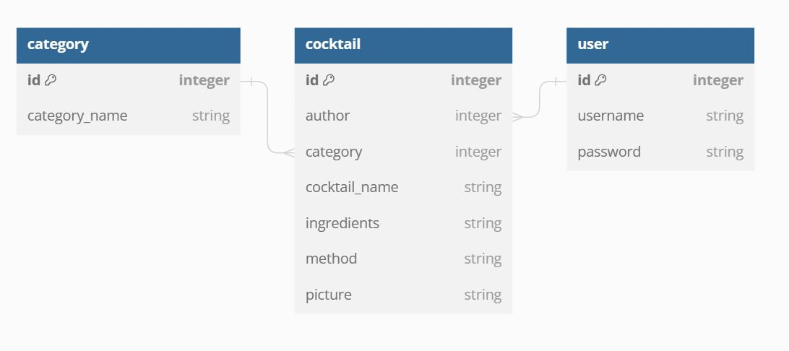

# Cocktail Corner

Developed for educational purposes as part of the Code Institute diploma in web development.

- - -

# Project Goals

## User Stories

As an initial user I want to:

- Clearly understand the purpose of the website.
- Navigate around the site with ease.
- View recipies submitted by others.
- Be guided to register an account.
- Register an account easily without providing personal information.

As a returning user I would also want to:

- Be able to log in and out with ease.
- Add recipies of my own to the websie.
- View all of my recipies in one place.
- Edit my recipies.
- Delete my recipies.
  
As an administrator of the website I want to:

- Create, amend and delete categories.
- Add, edit or delete recipies added by users.
  
- - -

# Database Model

An initial database plan was modelled using [dbdiagram.io](https://dbdiagram.io/home) 

  
- - -

# UX Design

- - -

# Features

- - -

# Technologies

- - -

# Testing

- - -

# Deployment

- - -

# References
